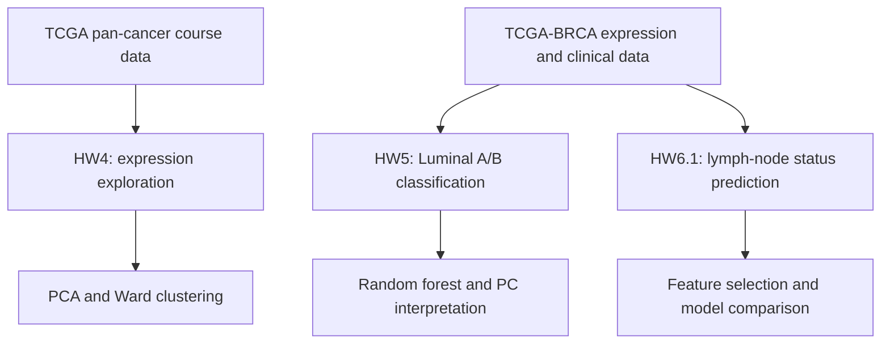
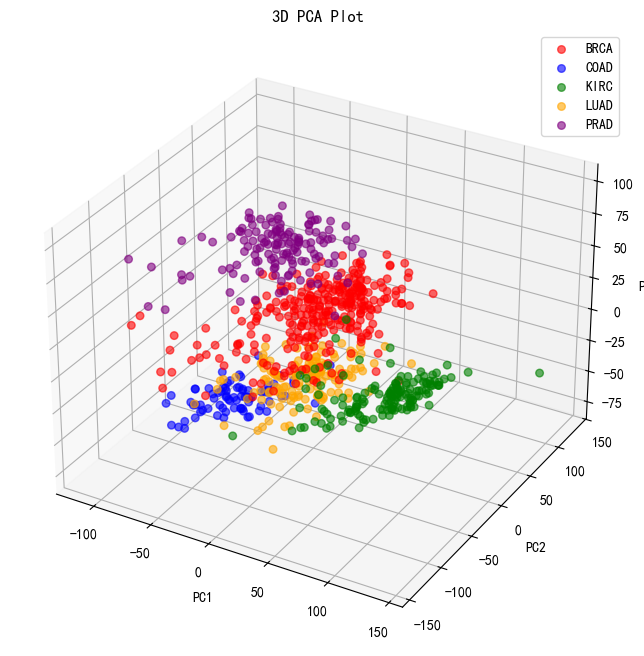
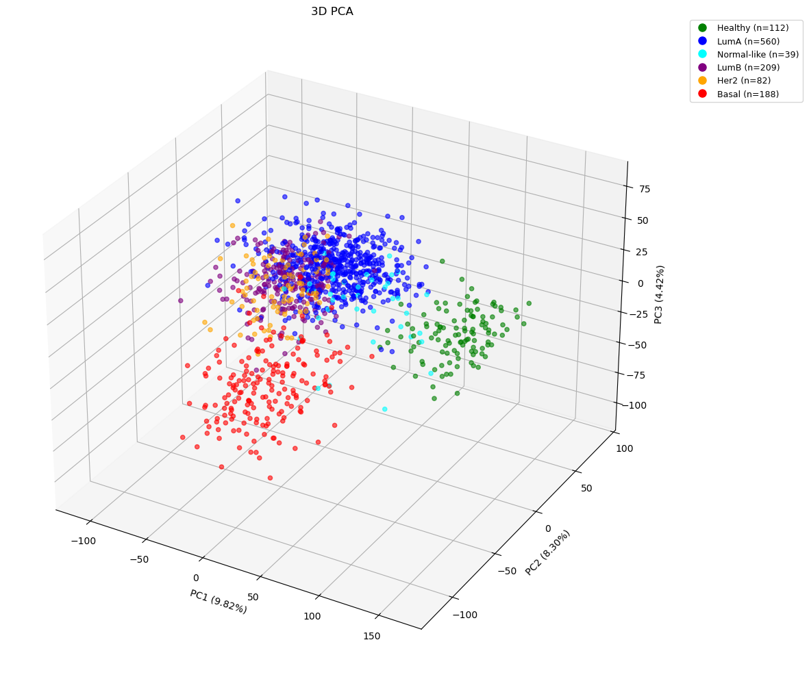
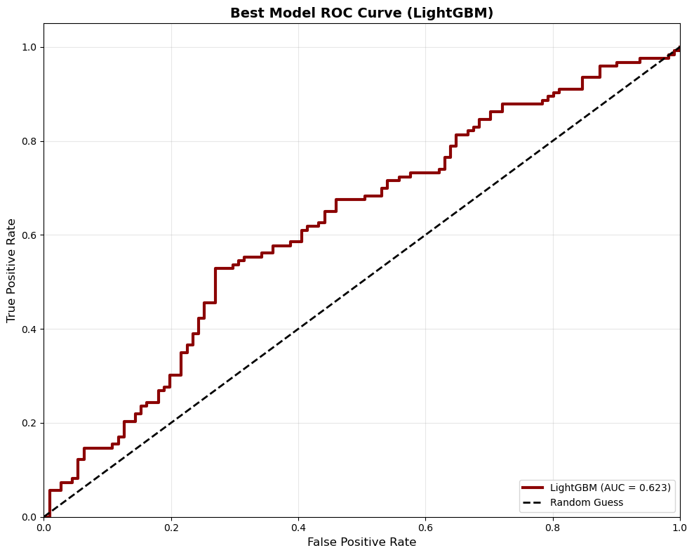

# Cancer Transcriptomics: Exploration and Prediction

**Zirui Chen · NTU Biomedical Data Science coursework portfolio**

Three linked analyses move from pan-cancer expression patterns to breast cancer
subtype classification and exploratory prediction of lymph-node status. The project
uses course-provided data from the **TCGA pan-cancer project** and **TCGA-BRCA**.

This repository documents the original coursework experiments. Figures and metrics
come from saved notebook outputs; no analyses were rerun for this presentation.

## Start here

- Browse the workflow and selected figures below for a project overview.
- Open the three notebooks for implementation details and additional results.
- Read the [data specification](data/README.md) for provenance and input formats,
  and the [method notes](docs/editorial_notes.md) for interpretation limits.

## Project workflow



These are related biological questions, not a single fitted-model pipeline.
HW6.1 shares the TCGA-BRCA input files with HW5 but does not depend on its trained model.

## Analyses

| Notebook | Question | Main methods |
| --- | --- | --- |
| [01 · Pan-cancer exploration](notebooks/01_pan_cancer_exploration.ipynb) | Do expression patterns recover tumor types, and how does BRCA subdivide? | PCA, variance filtering, Ward clustering, cluster-number diagnostics, exploratory gene contrasts |
| [02 · Luminal A/B classification](notebooks/02_luminal_subtype_classification.ipynb) | Can PC-based expression features distinguish supplied Luminal labels? | Random forest, MCC-based grid search, Boruta on PCs, loading-based gene interpretation |
| [03 · Lymph-node status prediction](notebooks/03_lymph_node_status_prediction.ipynb) | Can expression distinguish the course-defined N0/N+ labels? | Clinical label processing, ANOVA selection, RF, XGBoost, LightGBM, gradient boosting and soft voting |

The notebooks can be read independently. Each uses its own input-loading steps;
Notebook 03 reuses the raw files from Notebook 02, not its fitted models or outputs.

## Selected recorded results

| Analysis | Result from the original homework |
| --- | --- |
| Pan-cancer | 801 samples; 1,419 retained genes; Ward k = 5: ARI 0.993 and NMI 0.991 |
| Luminal A/B | 769 samples; baseline MCC 0.5709, tuned MCC 0.5693; both accuracy 0.8398 |
| Boruta comparison | Seven of ten PCs accepted; selected-PC MCC 0.5514 |
| N0/N+ | 1,167 sample records; highest compared test AUC 0.6225, from LightGBM |

These are **saved coursework results**, not newly generated or independently
validated estimates. Preprocessing and validation limitations are described in each
notebook. In particular, HW5 preprocessing precedes the split; HW6.1 includes mixed
sample types, does not group by patient, and reuses test scores for model selection.

## Selected figures and findings

### 1. Pan-cancer expression structure



*Original three-dimensional PCA projection. Colors denote the supplied BRCA, COAD,
KIRC, LUAD and PRAD labels, not predicted clusters.*

The projection illustrates broad expression structure across the five cancer types.
In the separate Ward clustering analysis, five clusters gave an adjusted Rand index
of **0.993** and normalized mutual information of **0.991** against the supplied labels.
These measure clustering agreement, not held-out classification performance.

[Explore the pan-cancer notebook →](notebooks/01_pan_cancer_exploration.ipynb)

### 2. Breast cancer subtype structure and Luminal classification



*Original PCA of the broader breast expression dataset. The saved figure uses the
course labels, including “Healthy”; it is not limited to the Luminal A/B training subset.*

The overlapping Luminal groups motivate a supervised comparison using PC-based
features. The Luminal A/B analysis includes **769 samples**. Baseline and tuned random
forests both recorded **83.98% accuracy**; tuning did not improve MCC
(**0.5709 → 0.5693**). Boruta retained seven of ten PCs, with a selected-PC MCC of
**0.5514**. Feature selection therefore did not improve the recorded comparison either.

PC loadings support exploratory gene interpretation, not validated biomarker claims.
Because preprocessing preceded the split, these scores require cautious interpretation.

[Explore the Luminal subtype notebook →](notebooks/02_luminal_subtype_classification.ipynb)

### 3. Exploratory lymph-node status prediction



*Original ROC curve. The plotted AUC is rounded to 0.623; the recorded value is 0.6225.
The diagonal represents chance-level discrimination.*

This analysis compares expression-based models for the course-defined **N0/N+** labels.
LightGBM had the highest compared test AUC (**0.6225**), indicating modest discrimination
in this experiment. The figure's original “Best Model” title means best among the
compared models, not an independently validated final model.

The analysis includes **1,167 sample records**, not necessarily 1,167 unique patients.
Mixed sample types, the absence of patient-grouped splitting, and model selection using
test scores limit the result. This is an exploratory coursework exercise, not a
clinically validated predictor.

[Explore the lymph-node status notebook →](notebooks/03_lymph_node_status_prediction.ipynb)

## Data sources

| Analysis | Source described in the coursework | Inputs |
| --- | --- | --- |
| HW4 | TCGA pan-cancer project | Expression matrix and supplied cancer-type labels |
| HW5 | TCGA-BRCA | Expression matrix and clinical/subtype annotations |
| HW6.1 | Same TCGA-BRCA files used in HW5 | Expression matrix and clinical records used to derive N0/N+ labels |

These are course-provided extracts. Exact filenames, orientation, sample identifiers
and label handling are documented in [data/README.md](data/README.md). The repository
does not imply that the three tasks use identical cohorts or interchangeable labels.

## Read the project

Start with a notebook above. English explanations introduce each stage; saved figures
appear next to the corresponding analysis. Full original stdout is retained under
`results/` for reference. No analysis cells were executed while preparing this edition.

## Repository layout

| Location | Contents |
| --- | --- |
| `notebooks/` | Three self-contained analysis notebooks |
| [data/README.md](data/README.md) | TCGA provenance, filenames, matrix orientation, IDs and label definitions |
| `data/raw/` | Local CSV inputs; ignored by Git |
| `figures/` | Figures copied from the original notebooks |
| `results/` | Original stdout, selected recorded metrics and schema summary |
| [docs/editorial_notes.md](docs/editorial_notes.md) | Scope of the edits and methodological qualifications |
| `requirements.txt` | Packages referenced by the code; original versions were not recorded |

## Optional local execution

The saved results can be read without running anything. To run the notebooks later,
install the listed packages in an isolated Python environment and place the four
CSV files in `data/raw/`, following the [data specification](data/README.md).

```bash
python -m pip install -r requirements.txt
python -m jupyterlab
```

Open from the repository root or `notebooks/`. Notebook 02 includes a grid search
with 2,160 CV fits; Notebook 03 includes a randomized search and boosted-tree models.
The original package versions were not captured, so identical results across
environments are not guaranteed. The editorial pass included static syntax and
file-link checks only, not an execution or dependency-compatibility test.

## Coursework provenance

Adapted from Homework Assignments 4, 5 and 6.1 in the NTU Biomedical Data Science
Big Data course. The tasks and datasets were supplied by the course; the notebooks
contain the student's implementations and recorded analyses. The presentation has
been edited for readability while retaining the original modeling workflow.
